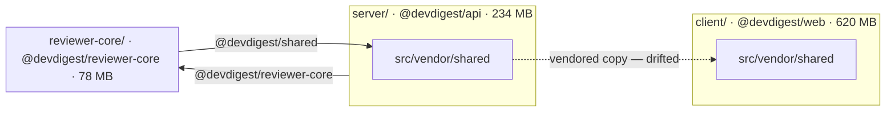

# Report template

Copy this skeleton. Keep the headings verbatim and in order — they are the contract.

## Graph conventions

Follow the `mermaid-diagram` skill for syntax; these are the conventions specific to this report.

- `flowchart LR`. One `subgraph` per package, labelled with the package's directory and npm name.
- **Solid arrow** = source import through a tsconfig `paths` alias. Label the edge with the alias.
- **Dotted arrow** (`-.->`) = vendored copy, not a live edge. Label it with the path.
- Node labels carry the package's own installed size, so the graph doubles as a size overview.
- External npm packages appear **only** when a finding references them. A graph showing every
  dependency is unreadable and tells the reader nothing.
- Mark a cycle explicitly — a bidirectional pair of solid arrows plus a note in `## Findings`.

## Skeleton

````markdown
# Dependency report — <repo or scope> (<YYYY-MM-DD>)

## Scope

Analyzed: <list every package: path, npm name, manager, lockfile>.
Excluded: <what and why — build output, gitignored trees, orphans without a manifest>.
Mode: offline (lockfiles + installed trees on disk) | offline + online pass.

## Dependency graph



## Size breakdown

Per-package totals:

| Package | Manager | Installed | Metric that matters |
|---|---|---|---|
| ... | ... | ... | Browser bundle / install size / dev-only |

Largest single dependencies (own size, excluding transitives):

| Package | Dependency | Version | Own size | Note |
|---|---|---|---|---|
| ... | ... | ... | ... | ... |

## Findings & Priorities

### P0

**DEP-05 — `server/src/services/review-service.ts` imports `reviewer-core/src/pipeline.js` directly**
<one sentence on the failure mode.>
Proposed: <exact change, exact file>. Confidence: high.

### P1

...

### P2

...

### Info

...

## Summary

1. <most important action, naming the file to change>
2. ...
3. ...

## Checked and clean — do not "fix" these

- <thing that looks wrong but is deliberate, and why>
````

## Rules for filling it in

- An empty tier keeps its heading and reads `_None._`. Do not drop the heading.
- Every finding opens with its DEP id and the specific file, package, or dependency. If you cannot
  name one, it is not a finding.
- Every finding ends with a **Proposed:** line naming the exact change and file, and a
  **Confidence:** when the finding rests on inference rather than a file you read.
- `## Summary` is 3–5 items, ordered by priority, each pointing at a finding above. It is not a
  restatement of the whole report.
- Sizes carry their unit and say whether they are own-size or a subtree total.
- If a number could not be measured, write `unverified` rather than an estimate.
