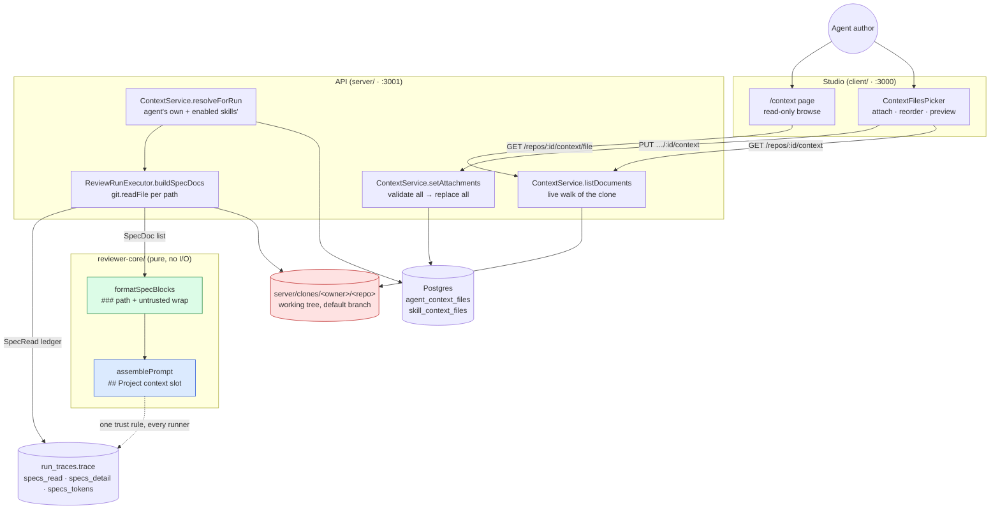
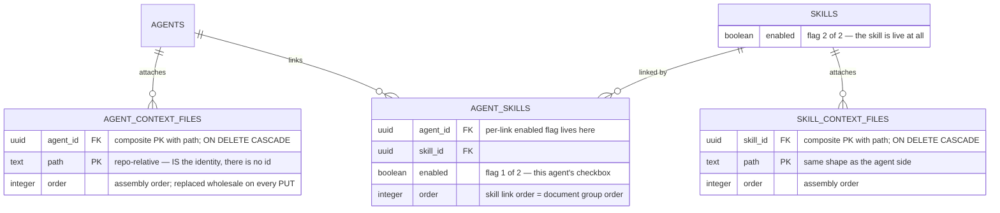
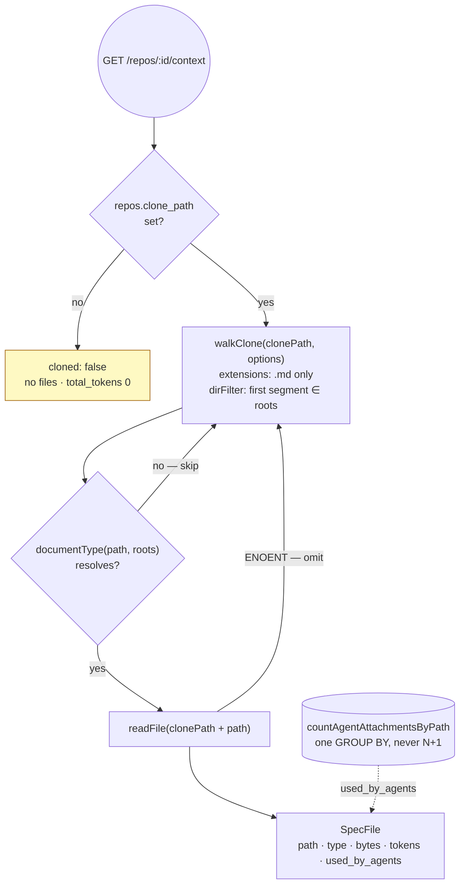
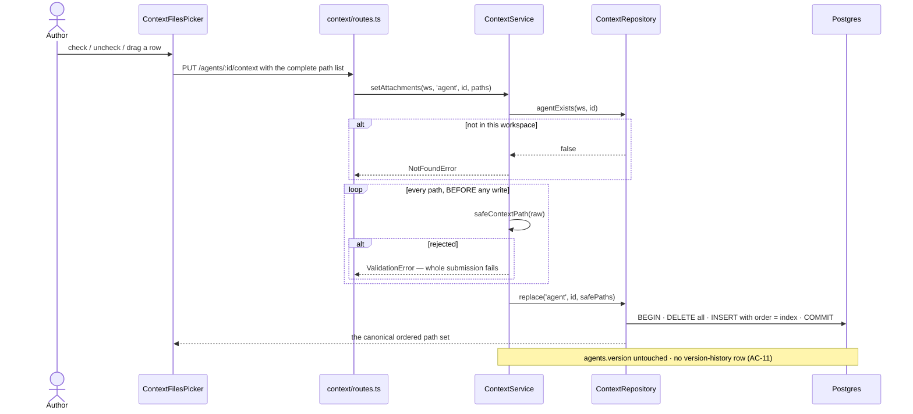

# Project context — architecture diagrams

An agent author attaches an **ordered** set of the repository's own `.md`
documents to an agent, or to a skill (where every agent linking that skill
inherits them). On every review run the server reads those documents **fresh off
the clone** and assembles them into `reviewer-core`'s `## Project context` prompt
slot, one `### <repo-relative path>` heading per document, each body wrapped in
`<untrusted source="spec:<path>">`.

Nothing here is uploaded, edited or stored as content. **The file in the
repository is the record** — `agent_context_files.path` is the whole row, and the
only way to change a document is to change it in the repository and sync the
clone. Migration `0015_light_violations.sql` adds the two link tables; this repo
never applies migrations on boot, so run `pnpm db:migrate` in `server/` before
the routes will work.

---

## 1. The path one document takes



The load-bearing split: **the database stores paths, the clone stores content,
and the two only meet inside a single review run.** Discovery
(`server/src/modules/context/service.ts:39-90`) and the review-time read
(`server/src/modules/reviews/run-executor.ts:503-560`) both go to the clone
independently — nothing caches a document body between them.

---

## 2. Data model

Both tables land in `0015_light_violations.sql`. They are structurally
identical and deliberately separate, so each can carry its own `ON DELETE
CASCADE` to a different parent.



**A path is not scoped to a repo.** An attachment means "this document, by path,
in whichever repo is being reviewed"
(`server/src/db/schema/agents.ts:83-88`), which is what lets one agent be reused
across repositories that share a convention — and is why the picker's active repo
only decides what it can *offer*, not what an attachment *means*
(`client/src/app/agents/[id]/_components/AgentEditor/_components/ContextTab/ContextTab.tsx:22-25`).

A link table rather than a `jsonb` column on `agents` is also what makes
**attaching a document leave `agents.version` alone**: a jsonb config column would
be inspected by `isConfigChange` and bump the version
(`server/src/db/schema/agents.ts:70-76`).

---

## 3. Discovery is a live walk, not an index



There is **no cache, no index and no `/context/reindex` route** — the module
docblock says so and explains why (`server/src/modules/context/routes.ts:19-22`,
`service.ts:15-20`): the documents are a handful of markdown files under two or
three roots, so walking them costs less than the invalidation logic an index
would need, and a freshly `git pull`ed document appears without anyone pressing a
button. The dead `useReindexContext` hook that used to post to a route the server
never exposed was deleted with this change
(`client/src/lib/hooks/core.ts:1-11`).

The walk **extends the indexer's walker rather than forking one**
(`server/src/modules/repo-intel/pipeline/walk.ts:56-76`). `WalkOptions` can only
ever narrow it: `EXCLUDED_DIRS` is checked before `dirFilter` and unconditionally
(`walk.ts:126-128`), symlinks are still never followed, and `MAX_FILE_SIZE`
(400 KB) and `MAX_INDEXED_FILES` (5 000) still bound the result
(`server/src/modules/repo-intel/constants.ts:42-43`).

`used_by_agents` counts **direct agent attachments only**. Skill-inherited ones are
deliberately excluded: the number answers "how many agents chose this file", and
folding in every agent that happens to link a popular skill would make its
document look universally adopted
(`server/src/modules/context/repository.ts:113-134`, asserted at
`server/test/context.it.test.ts:286`).

`cloned: false` is a first-class state, not an error — a repo can be added before
it is cloned, and both the page and the picker render it distinctly from "cloned
but no documents"
(`client/src/app/context/_components/ProjectContextView/ProjectContextView.tsx:65-75`).

---

## 4. Attachment: the API, and what a PUT deliberately does not do



| Route | Does |
|---|---|
| `GET /repos/:id/context` | Live discovery walk → `ContextListing` |
| `GET /repos/:id/context/file?path=` | One document's body → `SpecFileContent` |
| `GET /agents/:id/context` | `{ paths }`, in assembly order |
| `PUT /agents/:id/context` | Replace the whole ordered set |
| `GET /skills/:id/context` | `{ paths }`, in assembly order |
| `PUT /skills/:id/context` | Replace the whole ordered set |

`PUT` rather than `POST` because the body is the **complete** new set: array
position is the assembly order, so add, remove and reorder are one idempotent
replacement (`server/src/modules/context/routes.ts:24-26`). One bad path rejects
the **entire** submission before anything is written — a partial write would leave
the author with a set they never asked for and no indication which entry was
dropped (`service.ts:132-165`).

The service **bypasses `AgentsService.update` and `SkillsService.update` on
purpose** (`service.ts:140-143`). Attaching a document is not a change to the
agent's configuration or the skill's body, so it must not bump `agents.version` /
`skills.version` or write a version-history row. That is asserted end to end in
`server/test/context.it.test.ts:183`.

`safeContextPath` delegates to the intent module's `safeRepoRelativePath` — one
containment implementation in the server — then narrows the extension to `.md`
alone (`server/src/modules/context/helpers.ts:55-61`). Inherited from the intent
gate: max 200 characters, max 6 path segments, a single
`^[A-Za-z0-9._\-/]+$` allowlist, and rejection of `..`, `\`, `~`, leading `/` and
NUL (`server/src/modules/intent/helpers.ts`). Widening the extension set means
widening the preview too — `.txt` and `.rst` are rejected because the UI renders
markdown and only markdown (`server/src/modules/context/constants.ts:12-20`).

---

## 5. Merge order and the two enable flags

`ContextService.resolveForRun` (`service.ts:178-191`) produces the ordered,
duplicate-free path list for one agent's next review:

1. the agent's own attachments, in `agent_context_files.order`;
2. then each linked skill's attachments, in `agent_skills.order`, in
   `skill_context_files.order` within a skill.

A skill contributes **only when both `agent_skills.enabled` and `skills.enabled`
are true** — the same independent two-flag rule skill blocks already use
(`service.ts:171-176`, `server/test/context-run.it.test.ts:230`).

A path attached in several places is emitted **once, at its earliest position**
(`helpers.ts:80-93`). Worked example, with the agent attaching
`docs/api.md`, skill A (link order 0) attaching `specs/style.md` and
`docs/api.md`, and skill B (link order 1) attaching `docs/db.md`:

| Source | Paths in | Result position |
|---|---|---|
| agent's own | `docs/api.md` | 1 |
| skill A | `specs/style.md`, `docs/api.md` | 2 — `docs/api.md` already seen, skipped |
| skill B | `docs/db.md` | 3 |

Final: `docs/api.md`, `specs/style.md`, `docs/db.md`. Emitting the duplicate twice
would bill the same tokens twice and let a later, lower-priority attachment push a
deliberately-first document down the prompt.

---

## 6. Reading the clone — the invariant that makes this trustworthy

```mermaid
sequenceDiagram
    participant Exec as ReviewRunExecutor
    participant Ctx as ContextService
    participant Git as SimpleGitClient
    participant Clone as clone working tree
    participant Ledger as SpecRead[]

    Exec->>Ctx: resolveForRun(agent.id)
    Ctx-->>Exec: ordered paths
    loop each path
        Exec->>Exec: safeContextPath(path) — re-validated at the read
        alt rejected
            Exec->>Ledger: missing · unsafe_path · 0 tokens
        else
            Exec->>Git: readFile({owner,name}, safe)
            Git->>Clone: fs.readFile(cloneDir/owner/repo/path)
            alt throws
                Exec->>Ledger: missing · not_in_clone · 0 tokens
            else empty after trim
                Exec->>Ledger: missing · empty_file · 0 tokens
            else
                Exec->>Ledger: used · reason null · approxTokens(content)
            end
        end
    end
    Note over Git,Clone: nothing on the review path moves this working tree<br/>off the default branch — fetchPullHead only creates a<br/>local pr-&lt;n&gt; ref, diff() works from base...head refs,<br/>sync() is reset --hard origin/&lt;branch&gt;
```

**This is the single most important invariant in the feature.**
`SimpleGitClient.readFile` reads the clone's *working tree*
(`server/src/adapters/git/simple-git.ts:129-131`), and no step of a review moves
that working tree off the default branch: `fetchPullHead` fetches
`pull/<n>/head` into a local `pr-<n>` ref and checks nothing out
(`simple-git.ts:72-75`), `diff()` is a `base...head` ref diff
(`simple-git.ts:94-97`), and `sync()` is `reset --hard origin/<branch>`
(`simple-git.ts:78-88`). So the documents are the repository's committed rules as
of the last sync — **not whatever the PR under review says they are**. If anyone
later adds a `git checkout` of the PR head to this path, a PR could rewrite the
rules it is judged by inside its own diff, and this read must be re-pinned to the
default branch explicitly. The invariant is spelled out in the method's docblock
(`server/src/modules/reviews/run-executor.ts:471-499`) and pinned by
`server/test/context-run.it.test.ts:275`.

Each path is **re-validated with `safeContextPath` immediately before the read**
even though it was validated on write: the gate belongs at the dangerous
operation, because `SimpleGitClient.readFile` joins onto the clone directory with
no containment check of its own.

**Failure is never fatal.** A lookup failure, a missing file, an unreadable file
or an empty one is recorded in the ledger with a reason, written to the run log,
and the review continues (`run-executor.ts:503-560`). There is **no truncation
anywhere** — a document is used whole or reported missing.

---

## 7. The assembled block

`formatSpecBlocks` lives in `reviewer-core` beside `formatSkillBlocks` and for the
identical reason: the studio server and any CI runner must apply **one** trust
rule, and a divergence there is a prompt-injection hole rather than a cosmetic bug
(`reviewer-core/src/prompt.ts:105-121`).

```text
## Project context
### docs/architecture.md
<untrusted source="spec:docs/architecture.md">
The api/ module must not import db/ directly.
</untrusted>

### specs/style.md
<untrusted source="spec:specs/style.md">
…
</untrusted>
```

The path appears **twice by design** — the heading is what the model reads and can
cite in a finding, the delimiter label is what ties the block to the shared
`INJECTION_GUARD` appended to every system prompt
(`reviewer-core/src/prompt.ts:15-27`, `:235`). Every document is untrusted
without exception: unlike a skill, which can be `source: 'manual'` and therefore
trusted, a repository document is whatever the clone happens to contain.
`wrapUntrusted` replaces an embedded `</untrusted>` with `<\/untrusted>`, so a
document cannot close its own delimiter and escape into instruction position
(`prompt.ts:44-48`, asserted at `reviewer-core/test/prompt.test.ts:110`).

Section order inside the user message is fixed by `assemblePrompt`
(`prompt.ts:249-273`): task → `## PR description` → `## Intent` →
`## Skills / rules` → `## Relevant memory` → `## Repo skeleton` →
**`## Project context`** → `## Callers of changed symbols` → `## Diff to review`.
No attached document → the section is **omitted entirely** and the prompt is
byte-identical to a run with nothing attached (`prompt.ts:266`,
`reviewer-core/test/prompt.test.ts:154`).

`ReviewInput.specs` / `PromptParts.specs` changed from `string[]` to
`SpecDoc[]` (`{ path, content }`) — a **breaking type change with no
compatibility shim on purpose**, so the compiler finds every caller
(`reviewer-core/src/prompt.ts:84-96`). The old shape labelled blocks positionally
as `spec-0`, `spec-1`, which meant a document's identity never reached the model.

---

## 8. The trace ledger

`specs_read` was hardcoded to `[]` for the whole life of `run-executor.ts`, which
made "no document was read" and "the feature does not exist" indistinguishable in
a trace. It is now derived from the ledger and never a literal
(`run-executor.ts:365-372`).

| Trace key | Type | Written by | Contents |
|---|---|---|---|
| `specs_read` | `string[]` | `ReviewRunExecutor` | Paths with `status: 'used'` |
| `specs_detail` | `SpecRead[]` · nullish | `ReviewRunExecutor` | The full ledger, misses included |
| `specs_tokens` | `int` · nullish | `ReviewRunExecutor` | Sum of `tokens` across the used documents |

One `SpecRead` is `{ path, status: 'used' | 'missing', reason, tokens }`, with
`reason` null on `used` and one of `unsafe_path` / `empty_file` / `not_in_clone`
on `missing` — the same vocabulary the intent module's source ledger uses
(`server/src/vendor/shared/contracts/trace.ts:73-92`).

`specs_detail` and `specs_tokens` are `.nullish()`, not `.default([])`, because
`run_traces.trace` is a **frozen jsonb snapshot**: every trace persisted before
this change lacks the keys and must still parse, and `.default([])` would make the
field required on output and break every existing `RunTrace` constructor
(`trace.ts:109-124`). The ledger is also hoisted out of the `try` so a run that
fails *after* the documents were read still reports them
(`run-executor.ts:188-193`, `:401-412`).

The trace drawer's Configuration → **Specs read** row renders the used paths and
keeps the missing ones visible with their reason beside them, rather than hiding
them — a review that ran without a rule the author believed was in force is
exactly what that row is for
(`client/.../RunTraceDrawer/TraceBody/TraceBody.tsx:22`, `:40-67`). `specs_detail` is read
defensively (`?? []`) because pre-change traces do not have it.

Two things worth knowing when reading a trace:

- `specs_tokens` is **recorded but not rendered** anywhere in the studio today —
  it exists in the persisted trace and in the contract, and the only client
  reference is a test fixture.
- `buildRunTrace` in `server/src/platform/trace-builder.ts` also carries the new
  fields, but **the studio review path does not go through it** —
  `ReviewRunExecutor` hand-builds its `RunTrace` literals
  (`server/src/platform/trace-builder.ts:41-45`).

---

## 9. The studio surfaces

| Surface | File | Notes |
|---|---|---|
| `/context` page | `client/src/app/context/_components/ProjectContextView/` | Read-only browse: list, type badge, "used by N agents", rendered markdown, footer totals |
| Agent editor → Context tab | `client/src/app/agents/[id]/.../ContextTab/` | Attach the agent's own documents |
| Skill editor → Context tab | `client/src/app/skills/[id]/.../ContextTab/` | Attach documents every linking agent inherits |
| Shared picker | `client/src/components/ContextFilesPicker/` | Mounted by both editors; owns no server state |
| Sidebar entry | `client/src/vendor/ui/nav.ts:31` | `WORKSPACE` group, `g x` shortcut |

The `/context` page is **read-only by design**: there is no create, edit, upload,
delete or refresh control on it, and adding one would be a change of contract, not
a feature. The server exposes no write path either — `GitClient` has no write
method, and `sync()` would `reset --hard` any local edit away
(`ProjectContextView.tsx:1-12`, negative test at `ProjectContextView.test.tsx:104`).

The picker lives in `src/components/` rather than one editor's `_components/`
because both editors mount it, and it takes `title`/`note` as **props** so each
caller supplies copy from the i18n namespace it already declares — reaching into
`agents`/`skills` from the shared component would throw `MISSING_MESSAGE` in
whichever test provider lacks it (`ContextFilesPicker.tsx:1-15`).

Two interaction rules ported from `SkillsTab` and worth preserving:

- **Reordering is disabled while a filter is active.** Filtering hides rows that
  still occupy prompt-block slots, so there is no honest drop target
  (`ContextFilesPicker.tsx:74-77`).
- **Arrow buttons are the keyboard-reachable reorder path**, alongside drag
  (`ContextFilesPicker.tsx:186-198`).

An attached path with no matching discovered file still renders a row, badged
`not in repo` — the document was renamed or deleted, and hiding it would conceal
that the next review will report it `not_in_clone`
(`ContextFilesPicker/helpers.ts:19-31`).

---

## 10. Configuration and operations

| Setting | Where | Default |
|---|---|---|
| `DEVDIGEST_CONTEXT_ROOTS` | process env, read in `server/src/platform/config.ts:29` | `specs,docs,insights` |

Roots are **process-level, not per-workspace** — a deliberate deviation from the
spec's open questions. They follow the `REPO_INTEL_ENABLED` precedent: the roots
describe how *this deployment* lays its repositories out, the way the clone
directory does, and a per-workspace override would need a settings row, a UI and a
migration to express a value that is identical for every workspace on a
local-first tool (`config.ts:65-80`).

Each comma-separated entry must be **one boring path segment** matching
`^[A-Za-z0-9._-]+$`; `.`, `..` and anything with a separator or glob
metacharacter is dropped rather than escaped. If every entry is dropped the
parser falls back to the defaults rather than walking the whole clone, which is
what an empty root list would otherwise mean (`config.ts:85-96`).

Token counts everywhere are `ceil(chars / 4)` — the tokenizer adapter's
*heuristic*, not the tiktoken encoder
(`server/src/adapters/tokenizer/index.ts:21-23`). That is on purpose: the browser
computes the same formula with no encoder available, so a real BPE count on the
server would make the picker's number and the trace's number disagree for every
document (`server/src/modules/context/helpers.ts:15-25`).

**The 20 000-token figure is a WARNING threshold, not a cap.** Nothing is
truncated, capped or dropped at it — the picker shows an advisory line and that is
all (`server/src/modules/context/constants.ts:22-31`,
`client/src/components/ContextFilesPicker/constants.ts:10-19`). The number derives
from an observation about skill blocks that was **never root-caused**
(`server/INSIGHTS.md:416`, "Why did the skills-on review run take 13 minutes
against 55 seconds without?"), so treat it as a placeholder for a measurement
rather than a measured limit, and do not promote it into a cap without measuring
first.

Operator note: **migration `0015_light_violations.sql` must be applied by hand**
with `pnpm db:migrate` in `server/`. Migrations are never applied on boot in this
repo.

---

## 11. Known limits

- **The configured roots gate discovery only.** `safeContextPath` checks
  containment, depth, length and the `.md` extension — it does **not** check that
  the path sits under a configured root. `GET /repos/:id/context/file?path=` and
  both `PUT` endpoints therefore accept any `.md` inside the clone, whether or not
  discovery would have surfaced it
  (`server/src/modules/context/helpers.ts:55-61`, `service.ts:104-105`,
  `:155-157`).
- **A stale attachment is invisible to `documentType`.** After
  `DEVDIGEST_CONTEXT_ROOTS` changes, an attached path under a no-longer-configured
  root resolves to `null` and drops out of the listing — the picker still shows it,
  badged `not in repo` (`helpers.ts:36-40`).
- **AC-41 has no automated test.** The end-to-end criterion — a review on a PR
  that violates an attached document produces a finding *naming that document's
  path*, and lists it under `Specs read` in the same trace — is unverified. The
  integration suite covers the assembly (`### <path>` reaches the prompt), the
  ledger and the two-flag rule, but no test exercises a model producing such a
  finding, and `e2e/specs/` gained no flow for it.
- **`specs_tokens` is recorded, never displayed** — see section 8.
