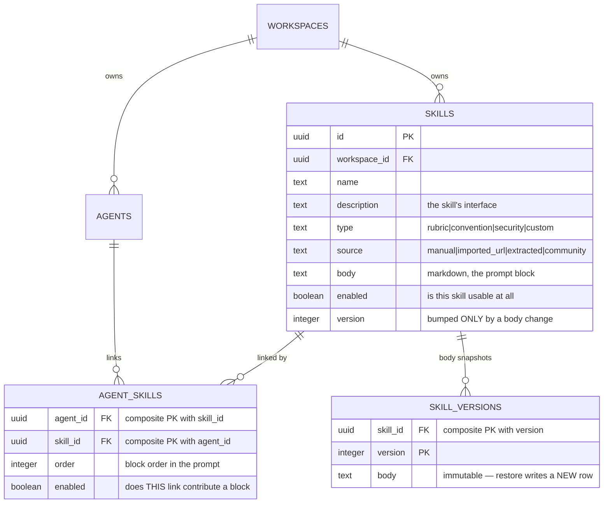
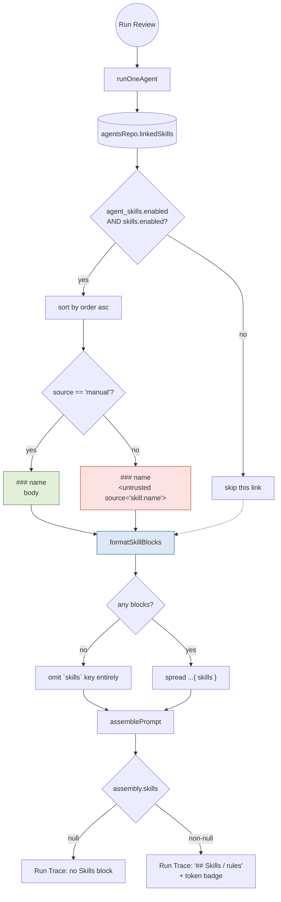
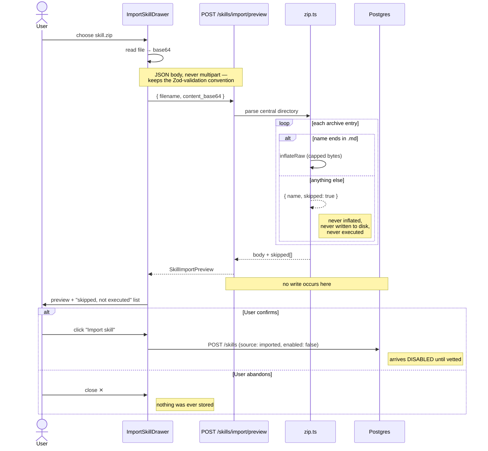
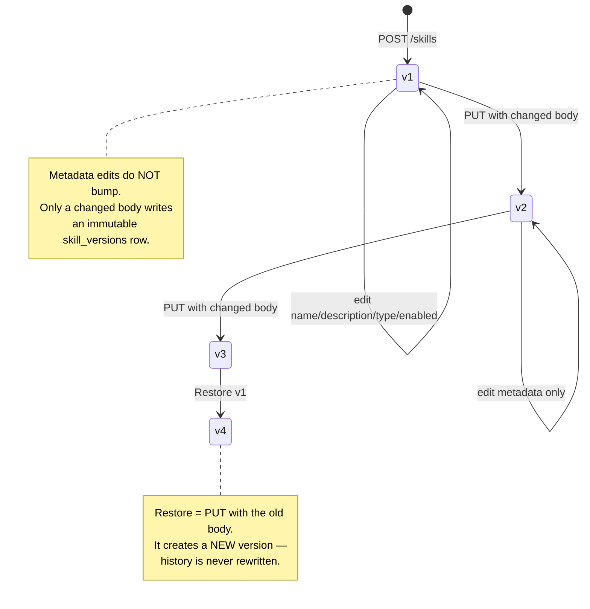

# Skills — architecture diagrams

Reusable, agent-linkable prompt blocks. A skill is **plain text and nothing
else** — no tools, no resources, no executable payload. That constraint is the
feature's security story, not a simplification: an imported skill is someone
else's instructions landing inside your agent's prompt.

---

## 1. Data model

`skills` and `skill_versions` shipped in migration `0000_init.sql`;
`agent_skills.enabled` is the one column this feature added (`0011`).

Two independent switches gate one block: `skills.enabled` (the skill itself)
and `agent_skills.enabled` (this agent's use of it). A linked-but-disabled
link keeps its `order`, so re-enabling restores its position.

---

## 2. Review-time resolution — the load-bearing path

Before this feature, `run-executor.ts` called `reviewPullRequest` without
`skills`, so `prompt_assembly.skills` was always `null`. This is the wiring
that makes the control experiment work.

`formatSkillBlocks` lives in `reviewer-core/src/prompt.ts` — not in the server —
so the studio and the CI runner (which resolves skills from the filesystem)
share **one** trust rule.

---

## 3. Import — nothing persists until you confirm

`POST /skills/import/preview` is a pure function. Abandoning or re-opening the
drawer can never leave orphan rows behind, because saving is a *separate* call.

The skipped-files list shown to the user is **generated by the server**, not
guessed by the UI — so the guarantee displayed is the same fact the parser
acted on.

---

## 4. Version lifecycle

Narrower than the agents module's `isConfigChange`: only `body` snapshots,
per the `skill_versions.body` column.

