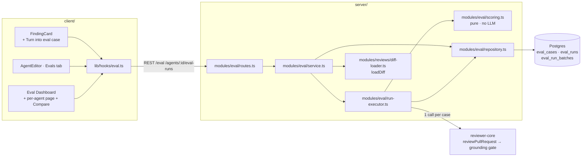

# Spec: Eval Pipeline for Reviewer Agents

Spec ID: SPEC-03
Created: 2026-08-30
Status: draft
Supersedes: —
Scope: touches `server/`, `client/` · reads `reviewer-core/` unchanged · does **not** touch `e2e/`, `mcp/`
Design sources: six product screenshots supplied by the user (finding action bar with "Turn into eval case", Eval Dashboard all-agents, per-agent Eval Dashboard, Compare-runs modal, agent editor Evals tab, eval-case editor modal) · the user's written L06 assignment in Ukrainian · the pre-landed contracts in `server/src/vendor/shared/contracts/eval-ci.ts` and the pre-landed copy in `client/messages/en/eval.json` · existing repo code cited inline

## Problem and user

The **agent author** edits a reviewer agent constantly — rewrites its system prompt,
switches its model, links or unlinks a skill — and today has no way to tell whether an
edit made the reviewer better or quietly broke it. The only feedback loop is running a
review on a real PR and reading the findings by eye, which is slow, unrepeatable, and
confounded by the PR changing underneath. Meanwhile the labelled dataset that could
answer the question already exists and is being thrown away: every `accept` / `dismiss`
the author clicked in L01–L05 is a human judgement persisted on
`findings.accepted_at` / `findings.dismissed_at`
(`server/src/db/schema/reviews.ts:50-51`), and the module that writes them already says
so — *"These decisions are the dataset later lessons build on (eval cases from
accept/dismiss …)"* (`server/src/modules/reviews/findings.ts`). The cost is a reviewer
whose quality drifts silently: a prompt edit that adds one useful rule and two new
false positives looks identical to one that adds three useful rules.

## Goals / Non-goals

**Goals**

- Turn a single reviewed finding into a frozen, replayable eval case in one click, with the expectation type derived from the decision the author already made.
- Replay a whole case set against an agent's current definition and report `recall`, `precision` and `citation_accuracy` computed entirely in code.
- Keep a run history whose entries are comparable, by snapshotting everything about the agent that could change between two runs.
- Let the author put two runs side by side and see both the metric deltas and the definition diff that produced them.

**Non-goals**

- **Export to CI.** `POST /agents/:id/export-ci`, `AgentManifest` YAML generation and the GitHub Actions runner are contract-ready in `eval-ci.ts` but are a separate lesson deliverable, not part of this spec.
- **An LLM judge.** The lab's harness needed one because "explained the cause" is not a substring; here the expectation is a `file:line` and the match is arithmetic. Scoring calls no model.
- **Skill-owned eval cases.** `EvalOwnerKind` admits `'skill'` and the schema stores it, but only `owner_kind = 'agent'` is exercised; the skill editor's Evals tab stays deferred.
- **Editing a case's expectation in bulk**, importing a case set from a file, or sharing sets across workspaces.
- **Folding eval spend into the existing cost surfaces.** See AC-25.

## User stories

- **US-1** — As an agent author, I want to turn a finding I accepted or dismissed into an eval case in one click, so that building a regression set costs me nothing beyond the reviewing I already do.
- **US-2** — As an agent author, I want to see every case in an agent's set with its last result, so that I know what the agent is being held to.
- **US-3** — As an agent author, I want to run the agent against every case in its set, so that I get one verdict on the whole definition rather than per-case anecdotes.
- **US-4** — As an agent author, I want `recall`, `precision` and `citation_accuracy` for a run, so that "better" and "worse" are numbers rather than impressions.
- **US-5** — As an agent author, I want the history of runs and the ability to compare two of them side by side, so that I can attribute a metric movement to the specific definition change that caused it.
- **US-6** — As an agent author, I want one place that shows every agent's eval health, so that I can see which reviewer is regressing without opening each one.

## Acceptance criteria (EARS)

> Terminology used below: a **case** is one frozen `(input diff, expectation)` pair.
> A **target** is one `file` + `start_line`–`end_line` range inside an expectation.
> A **batch** is one execution of every case in an owner's set. A **grounded finding**
> is a finding that survived `groundFindings` (`reviewer-core/src/grounding.ts`).

**Case creation from a finding**

- **AC-1** *(event-driven)* — WHEN the author invokes "Turn into eval case" on a finding, the system shall create one eval case owned by the agent that produced the finding's review.
- **AC-2** *(state-driven)* — WHILE the source finding carries a non-null `accepted_at`, the created case's expectation kind shall be `must_find`.
- **AC-3** *(state-driven)* — WHILE the source finding carries a non-null `dismissed_at`, the created case's expectation kind shall be `must_not_flag`.
- **AC-4** *(unwanted behaviour)* — IF the source finding carries neither `accepted_at` nor `dismissed_at`, THEN the system shall reject the request with a validation error and create no case.
- **AC-5** *(ubiquitous)* — The created case's expectation shall contain exactly one target, whose `file`, `start_line` and `end_line` are copied verbatim from the source finding.
- **AC-6** *(ubiquitous)* — The created case's `input_diff` shall be the source PR's unified diff sliced to the finding's file, and nothing else.
- **AC-7** *(unwanted behaviour)* — IF the slice of the PR diff for the finding's file is empty, THEN the system shall reject the request with a validation error naming the file, and create no case.
- **AC-8** *(unwanted behaviour)* — IF the source finding's review has no `agent_id`, THEN the system shall reject the request with a validation error and create no case.
- **AC-9** *(event-driven)* — WHEN "Turn into eval case" is invoked a second time for a finding that already has a case, the system shall return the existing case and shall create no second case.
- **AC-10** *(ubiquitous)* — The created case shall record the id of the finding it was derived from, and shall record its creation timestamp.
- **AC-11** *(state-driven)* — WHILE a finding already has an eval case, the finding's action bar shall render its "Turn into eval case" control in an already-in-set state.
- **AC-12** *(unwanted behaviour)* — IF the source finding is later deleted, THEN the system shall retain the eval case and null its recorded source finding id.
- **AC-13** *(ubiquitous)* — A case, once created, shall be unaffected by any later change to the source finding's `accepted_at` or `dismissed_at`.

**Case management**

- **AC-14** *(ubiquitous)* — The system shall list every case belonging to a given owner, newest first.
- **AC-15** *(event-driven)* — WHEN the author edits a case's name, input diff or expectation, the system shall persist the change and leave every previously recorded result for that case unchanged.
- **AC-16** *(event-driven)* — WHEN the author deletes a case, the system shall delete that case's per-case results and shall leave every batch row intact.
- **AC-17** *(unwanted behaviour)* — IF a submitted expectation contains zero targets, THEN the system shall reject the submission and persist no part of it.

**Run execution**

- **AC-18** *(event-driven)* — WHEN the author starts a run for an agent, the system shall create one batch, respond before the first case is executed, and execute the cases in the background.
- **AC-19** *(ubiquitous)* — A batch shall execute every case belonging to its owner at the moment the batch was created.
- **AC-20** *(ubiquitous)* — A batch shall make exactly one LLM call per case.
- **AC-21** *(ubiquitous)* — A batch shall pass the engine only the case's stored diff, the agent's system prompt and the agent's enabled skill bodies; it shall pass no repo map, no project-context documents, no callers digest, no intent and no memory.
- **AC-22** *(ubiquitous)* — A batch shall run every case with the `single-pass` strategy, regardless of the agent's configured strategy.
- **AC-23** *(unwanted behaviour)* — IF one case fails to execute, THEN the system shall record that case's failure reason, mark it failed, and continue executing the remaining cases.
- **AC-24** *(state-driven)* — WHILE a batch is executing, the system shall report its status as running and the client shall poll it.
- **AC-25** *(ubiquitous)* — A batch shall not write any row to `agent_runs`.

**Scoring**

- **AC-26** *(ubiquitous)* — Scoring shall make zero LLM calls.
- **AC-27** *(ubiquitous)* — A grounded finding shall count as matching a target when, and only when, its `file` equals the target's `file` and its `start_line`–`end_line` range intersects the target's range.
- **AC-28** *(ubiquitous)* — Matching shall not read a finding's or a target's severity, category, title or rationale.
- **AC-29** *(ubiquitous)* — For a `must_find` case, the system shall count each matched target as a true positive, each unmatched target as a false negative, and each grounded finding matching no target as a false positive.
- **AC-30** *(ubiquitous)* — For a `must_not_flag` case, the system shall count each grounded finding matching a target as a false positive, and shall count no true positives and no false negatives.
- **AC-31** *(ubiquitous)* — A `must_find` case shall pass when every one of its targets is matched; a `must_not_flag` case shall pass when no grounded finding matches any of its targets.
- **AC-32** *(ubiquitous)* — Batch `recall` shall be the sum of true positives divided by the sum of true positives and false negatives, summed over cases — never the mean of the per-case rates.
- **AC-33** *(ubiquitous)* — Batch `precision` shall be the sum of true positives divided by the sum of true positives and false positives, summed over cases.
- **AC-34** *(ubiquitous)* — Batch `citation_accuracy` shall be the count of findings that survived the grounding gate divided by the count of findings the model proposed, summed over cases.
- **AC-35** *(unwanted behaviour)* — IF a metric's denominator is zero, THEN the system shall report that metric as `1` and the surface displaying it shall label it as having no evidence rather than as a perfect score.
- **AC-36** *(ubiquitous)* — The system shall persist, per case result, the raw true-positive, false-positive, false-negative, kept and dropped counts from which its rates were computed.
- **AC-37** *(ubiquitous)* — The system shall persist, per case result, every finding the grounding gate dropped together with the gate's stated reason.

**Provenance and comparability**

- **AC-38** *(event-driven)* — WHEN a batch is created, the system shall snapshot the agent's system prompt, config version, provider, model and the id and version of each of its enabled linked skills.
- **AC-39** *(ubiquitous)* — A batch's snapshot shall be immutable, and shall not change when the agent is subsequently edited.
- **AC-40** *(ubiquitous)* — The system shall record, per batch, the total input tokens, output tokens, cost and duration it consumed.
- **AC-41** *(event-driven)* — WHEN the author compares two batches, the system shall report the delta for each of the three metrics and for cost, and shall return both snapshotted system prompts.
- **AC-42** *(unwanted behaviour)* — IF the two compared batches did not execute the same set of cases, THEN the system shall flag the comparison as being across different case sets and the comparison surface shall warn the author.
- **AC-43** *(state-driven)* — WHILE two compared batches differ in their snapshotted skill sets, the comparison surface shall show that difference alongside the system-prompt diff.

**Surfaces**

- **AC-44** *(ubiquitous)* — The agent editor shall expose an Evals tab listing the agent's cases with each case's last result, and a control that starts a run over all of them.
- **AC-45** *(ubiquitous)* — The left sidebar shall expose an Eval Dashboard entry that lists every agent with its latest three metrics, and the most recent runs across all agents.
- **AC-46** *(ubiquitous)* — The per-agent eval page shall show the three metrics with their deltas, a trend chart over the agent's runs, and a run history from which any two runs can be selected and compared.
- **AC-47** *(state-driven)* — WHILE an owner has no cases, the run control shall be disabled and the surface shall say so rather than starting an empty batch.

| US | ACs | ECs | Verification hint |
|---|---|---|---|
| US-1 | AC-1, AC-2, AC-3, AC-4, AC-5, AC-6, AC-7, AC-8, AC-9, AC-10, AC-11, AC-12, AC-13 | EC-1, EC-2, EC-3, EC-9 | integration |
| US-2 | AC-14, AC-15, AC-16, AC-17, AC-44, AC-47 | EC-4 | integration |
| US-3 | AC-18, AC-19, AC-20, AC-21, AC-22, AC-23, AC-24, AC-25 | EC-5, EC-6 | integration |
| US-4 | AC-26, AC-27, AC-28, AC-29, AC-30, AC-31, AC-32, AC-33, AC-34, AC-35, AC-36, AC-37 | EC-7, EC-8 | unit |
| US-5 | AC-38, AC-39, AC-40, AC-41, AC-42, AC-43, AC-46 | EC-10, EC-11 | integration |
| US-6 | AC-45 | EC-4 | unit |

## Edge cases

- **EC-1** — The finding's PR was never cloned and its `pr_files.patch` is null, so the diff reconstruction yields nothing → covered by AC-7. Deliberately a hard rejection: a case with an empty diff scores 0 findings forever and would read as a real regression.
- **EC-2** — The finding was produced by the seeded demo review, which has no `agent_id` → covered by AC-8.
- **EC-3** — The author accepts a finding, turns it into a case, then dismisses the same finding → covered by AC-13. The case keeps its `must_find` expectation; the set is a frozen fixture, not a live view of current opinion.
- **EC-4** — A workspace has agents but zero eval cases → covered by AC-47; the dashboard lists the agents with no metrics rather than an empty page.
- **EC-5** — A case's stored diff no longer parses (hand-edited to something invalid) → covered by AC-23; that one case fails with its parse error and the batch completes.
- **EC-6** — The agent's provider has no API key configured → covered by AC-23; every case fails with the same reason and the batch reports zero passes rather than hanging.
- **EC-7** — A set contains only `must_not_flag` cases, so recall has no denominator → covered by AC-35.
- **EC-8** — The model returns findings that all fail the grounding gate → `citation_accuracy` is 0, `precision` is 1 with a zero denominator per AC-35, and recall is 0. Correct and deliberately not special-cased: the agent found nothing real.
- **EC-9** — Two different findings in the same file and overlapping line ranges are both turned into cases → both are created; they are distinct cases with distinct source findings, and AC-9's idempotency is per finding, not per file.
- **EC-10** — The author adds a case between two runs and then compares them → covered by AC-42.
- **EC-11** — The author edits a linked skill's body between two runs without touching the agent → covered by AC-38 and AC-43; the skill's `version` differs between the two snapshots.

## Design review

| # | Type | Finding | Evidence | Proposed resolution | Status |
|---|---|---|---|---|---|
| 1 | missing state | The case-editor mockup shows `expected_output` as a bare JSON array of finding skeletons, with no field carrying the must_find / must_not_flag distinction the assignment requires | screenshot 6 (`Eval case · stripe-key-leak`) vs the assignment text | Store `{ kind, targets[] }`; the editor renders the kind as a labelled control above the JSON rather than burying it in the array | adopted (AC-5, AC-17) |
| 2 | missing state | No mockup shows what a finding looks like once it is already in the eval set, so a second click has undefined behaviour | screenshot 1 (action bar) | Idempotent create plus an already-in-set control state | adopted (AC-9, AC-11) |
| 3 | uncovered corner case | The compare modal shows a prompt diff only. Two runs can also differ by model, provider, or a linked skill's body, none of which the mockup accounts for | screenshot 4 (`Compare runs · v6 → v7`) | Snapshot all of them per batch; surface skill-set differences next to the prompt diff | adopted (AC-38, AC-43) |
| 4 | uncovered corner case | Nothing in the design prevents comparing two runs that executed different case sets, which makes the delta meaningless | screenshot 3 (run table with free-form checkboxes) | Flag and warn | adopted (AC-42) |
| 5 | inconsistency | The mockups show per-agent run counts and dollar figures that look like the existing agent-card stats (`142 runs · 78% accept · $0.04 avg`), inviting an implementation that writes eval runs into `agent_runs` | screenshot 5 vs `contracts/observability.ts` `AgentStats` | Eval runs are stored separately and never touch `agent_runs`; eval cost is reported only on eval surfaces | adopted (AC-25) |
| 6 | missing state | The metric tiles have no rendering for "no evidence" — a metric whose denominator is zero would display as 100% | screenshots 2, 3, 5 | Report `1` but label it as unevidenced | adopted (AC-35) |
| 7 | UX improvement | The dashboard mockup implies a "Run all agents" control; running every agent's whole set at once multiplies real LLM spend with no confirmation step | screenshot 2 (`Run all agents` button) | Out of scope for this spec — the per-agent run control is the only entry point | needs decision |
| 8 | uncovered corner case | `citation_accuracy` is a single ratio with no way to see which citation was hallucinated, so a drop is unactionable | assignment text; `ReviewOutcome.dropped` at `reviewer-core/src/review/run.ts:112` | Persist the dropped findings and the gate's reason per case | adopted (AC-37) |

## Module interactions

| Caller | Callee | What crosses the boundary | Existing (`path:line`) or new |
|---|---|---|---|
| `FindingsPanel` | `POST /findings/:id/eval-case` | a finding id | new |
| `EvalsTab` | `POST /agents/:id/eval-runs` | an agent id | new |
| `eval/service.ts` | `loadDiff` | container, review repository, workspace, pull, repo row | existing — `server/src/modules/reviews/diff-loader.ts:14` |
| `eval/service.ts` | `container.reviewRepo` | the shared review repository | existing — `server/src/platform/container.ts:107` |
| `eval/run-executor.ts` | `reviewPullRequest` | system prompt, model, parsed diff, injected LLM, skill bodies | existing — `reviewer-core/src/review/run.ts:141` |
| `eval/run-executor.ts` | `parseUnifiedDiff` | a raw diff string | existing — `server/src/adapters/git/diff-parser.ts:14` |
| `eval/service.ts` | `sliceDiff` | a parsed diff and a file path | existing — `@devdigest/reviewer-core` |
| `eval/repository.ts` | `eval_cases` / `eval_runs` / `eval_run_batches` | rows | tables existing (`server/src/db/schema/eval.ts`), columns extended |

**Contract impact** — additive only. `eval-ci.ts` gains `EvalExpectationKind`,
`EvalExpectedTarget`, `EvalExpectation`, `EvalBatchRecord` and `EvalCompare`;
`EvalRunRecord` gains nullable counter fields and `EvalCase` gains nullable
`source_finding_id` / `created_at`. No existing field changes type or nullability, and
no existing route changes shape, so this is a **minor** version bump for
`@devdigest/shared` with no deprecation window. Per `docs/skills/semver-discipline.md`,
new optional fields on a response object are additive for consumers.

## Non-functional requirements

- Scoring shall make **0** LLM calls.
- A batch shall make exactly **1** LLM call per case, and **0** additional calls for aggregation, comparison or dashboard assembly.
- A batch over **8** cases on a small model shall complete within **180 s**.
- A batch of **8** cases shall cost at most **$0.15** at the default reviewer model tier.
- The eval dashboard shall poll a running batch at an interval of **2 s** and shall stop polling within **1** poll interval of the batch reaching a terminal status.
- The three metrics shall each be a real number in the closed interval **[0, 1]**.
- Turning a finding into an eval case shall complete within **2 s** and shall make **0** LLM calls.
- Creating a case shall store at most **1** file's worth of diff, never the whole PR.

## Inputs and provenance

| Input | Source | Who can influence it | Trusted? |
|---|---|---|---|
| Finding id, agent id, batch ids | the user, via the UI | the user | yes — validated as uuids by the route schema |
| `input_diff` (auto) | a cloned repo on disk or persisted `pr_files.patch`, sliced by file | the PR author | **no** |
| `input_diff` (manual) | typed into the case editor | the user | **no** |
| `expected_output` | derived from a persisted finding, or typed into the case editor | the user | yes — structure validated by Zod; never rendered as markup |
| Agent system prompt | the `agents` table | the user | yes — it is the author's own prompt, passed as the system message exactly as reviews already do |
| Linked skill bodies | the `skills` table | the user, or an imported URL | **no** — already wrapped by `formatSkillBlocks` |
| Findings produced by a run | LLM output | the model | **no** |
| `dropped` reasons | the grounding gate | code | yes |

## Untrusted inputs

- **`input_diff`** — it is attacker-authorable PR content and it is interpolated into a prompt. It shall be placed only in the engine's diff section, which `assemblePrompt` already delimiter-wraps as untrusted (`reviewer-core/src/prompt.ts`); it shall never be concatenated into the system prompt, never executed, and never resolved as a filesystem path. A manually typed diff gets the same treatment as an auto-sliced one — the editor is not a trust boundary.
- **Linked skill bodies** — unchanged from the existing review path; they reach the model only through `formatSkillBlocks`, which wraps them in `<untrusted>` delimiters.
- **Findings returned by the model** — their `file`, `start_line` and `end_line` are compared arithmetically against stored targets and against the diff's line index. They shall never be used to read a file, and their `title` / `rationale` shall be rendered as markdown through the existing `Markdown` component, never as raw HTML.
- **`expected_output` JSON** — parsed with Zod before persistence. A malformed body is rejected whole (AC-17); no partial write occurs.

## Open questions

- Should the dashboard's "Run all agents" control from screenshot 2 exist? It multiplies spend across every agent with no confirmation. This spec proceeds under the assumption that it does **not** ship, and the per-agent run control is the only way to start a batch (design review row 7).
- Should a `must_find` case's false positives — findings the agent reported elsewhere in the same one-file diff — count against precision as strongly as a `must_not_flag` violation? This spec proceeds under the assumption that they do (AC-29), because a case's diff is a single file the author has fully judged.
- Should `eval_cases` for `owner_kind = 'skill'` be reachable from the skill editor? Not in this spec; the column keeps the value so a later lesson can add the surface without a migration.
