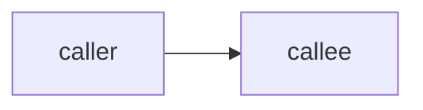

# Spec: <feature name>

Spec ID: SPEC-NN
Created: YYYY-MM-DD
Status: draft
Supersedes: —
Scope: <packages touched · packages explicitly not touched>
Design sources: <what was supplied — description, screenshot, Figma export, existing code, reference repo>

> Copy this file to `SPEC-NN-YYYY-MM-DD-<feature-slug>.md` in the right folder:
> `<package>/specs/` for a single package, the root `specs/` for two or more.
> Delete these quoted notes as you fill each section in.

## Problem and user

> Who has the problem, what they cannot do today, and what it costs them. One
> paragraph. If you cannot name the user, you do not have a spec yet.

## Goals / Non-goals

**Goals**
- …

**Non-goals**
- … <!-- things a reader would reasonably assume are included, and are not -->

## User stories

- **US-1** — As a `<user>`, I want `<capability>`, so that `<outcome>`.

## Acceptance criteria (EARS)

> One requirement per line. Always `shall`. Never `should`, `might`, `support`,
> `handle`, `etc.` Tag each with its EARS pattern.

- **AC-1** *(ubiquitous)* — The system shall …
- **AC-2** *(event-driven)* — WHEN `<trigger>`, the system shall …
- **AC-3** *(state-driven)* — WHILE `<state>`, the system shall …
- **AC-4** *(unwanted behaviour)* — IF `<condition>`, THEN the system shall …
- **AC-5** *(optional feature)* — WHERE `<feature is enabled>`, the system shall …

| US | ACs | ECs | Verification hint |
|---|---|---|---|
| US-1 | AC-1, AC-2 | EC-1 | unit |

> Verification hint is one of `unit` (mocked ports) · `integration`
> (`*.it.test.ts`, real Postgres) · `e2e` (a flow under `e2e/specs/`) ·
> `manual`. A hint, not a plan — no file names, no commands.

## Edge cases

- **EC-1** — … → covered by AC-n · or: explicitly out of scope, because …

## Design review

> What the design sources leave undefined. Zero findings is a valid result —
> never pad this table. Every row needs real evidence.

| # | Type | Finding | Evidence | Proposed resolution | Status |
|---|---|---|---|---|---|
| 1 | missing state | … | `<source>` or `path:line` | … | needs decision |

> Type: missing state · uncovered corner case · UX improvement · inconsistency ·
> accessibility. Status: `needs decision` · `assumed` (state the assumption) ·
> `adopted` (name the AC).

## Module interactions

| Caller | Callee | What crosses the boundary | Existing (`path:line`) or new |
|---|---|---|---|

**Contract impact** — what existing public surface changes · deprecation window ·
major / minor / patch. Or: *no public surface changes*.

## Non-functional requirements

> Measurable only: a number and a unit. Delete any line without one. A feature
> that calls an LLM states its model tier and a token / cost / latency budget.

- …

## Inputs and provenance

| Input | Source | Who can influence it | Trusted? |
|---|---|---|---|

> Sources in this repo are concrete: the user, the GitHub API, a cloned repo on
> disk, LLM output, the database, a webhook payload.

## Untrusted inputs

> For each input marked untrusted: what must be treated as adversarial, and what
> the system must **not** do with it — execute it, interpolate it into a prompt
> as instructions, render it unescaped, resolve it as a path.

- …

## Open questions

- … <!-- non-blocking. State the assumption the spec proceeds under. -->
